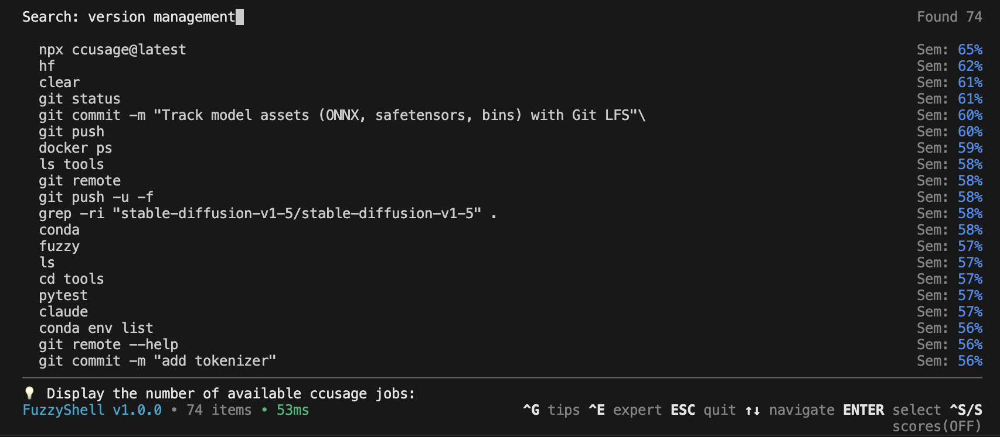

<div style="display: flex; justify-content: center; align-items: center; gap: 24px; margin-bottom: 32px;">
  <picture>
    <source srcset="assets/mascot_dark.png" media="(prefers-color-scheme: dark)">
    
  </picture>
</div>

**Lightning-fast semantic search for your shell history. Press Ctrl+F and find that command from last week—even if you forgot the exact text.**


# FuzzyShell



## Install (30 seconds)

```bash
curl -sSL https://raw.githubusercontent.com/mitchins/fuzzyshell/main/install_standalone.sh | bash
```

Then reload your shell and press **Ctrl+F**. That's it. 🎉

## What It Does

- **Ctrl+F** → Opens semantic search (replaces Ctrl+R)
- **Type naturally** → "list files" finds `ls -la`
- **Understands intent** → Finds commands by meaning, not just substrings
- **Smart ranking** → Recent + relevant commands first
- **Edit before run** → Commands appear in your prompt

## Requirements

- macOS or Linux
- Python 3.9+
- Bash or Zsh

---

<details>
<summary><b>More Details</b></summary>

### How It Works

FuzzyShell uses ML embeddings + BM25 ranking to understand what you're looking for:
- "show containers" → `docker ps`
- "git uncommit" → `git reset HEAD~`
- "find large files" → `find . -size +100M`

### Manual Install

```bash
pip install fuzzyshell
fuzzy --install-hook
```

### Commands

- `fuzzy` - Open search
- `fuzzy-ingest` - Re-scan history
- `fuzzy-rebuild` - Rebuild index
- `fuzzy-update` - Update to latest

### Uninstall

```bash
rm -rf ~/.fuzzyshell
# Remove the source line from ~/.zshrc or ~/.bashrc
```

</details>

<details>
<summary><b>Contributing</b></summary>

We love contributions! Check out [CONTRIBUTING.md](CONTRIBUTING.md).

```bash
git clone https://github.com/mitchins/fuzzyshell
cd fuzzyshell
python -m venv venv
source venv/bin/activate
pip install -e ".[test]"
pytest tests/
```

</details>

<details>
<summary><b>Tech Stack</b></summary>

- **Search**: ONNX-quantized sentence transformers
- **Storage**: SQLite with vector search
- **UI**: Rich TUI with syntax highlighting
- **Speed**: <100ms search on 10k+ commands

</details>

---

**License**: MIT | **Status**: 🟢 Active | [Report Issues](https://github.com/mitchins/fuzzyshell/issues)